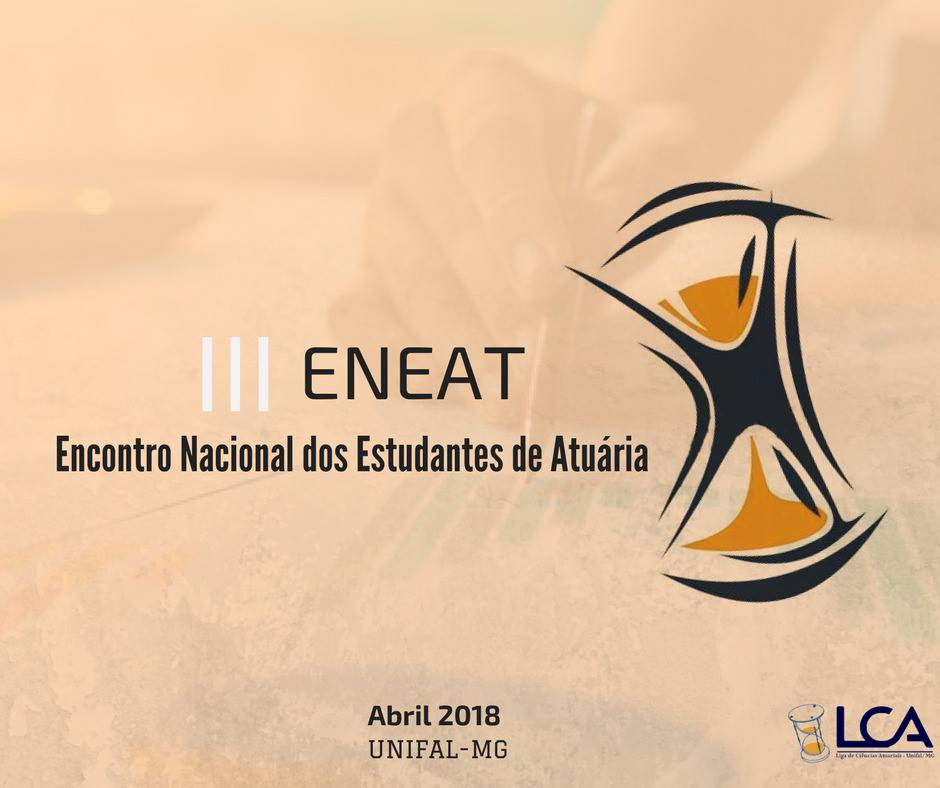
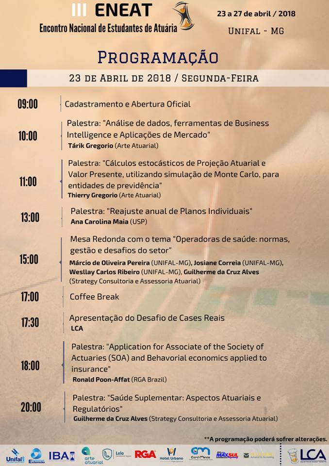
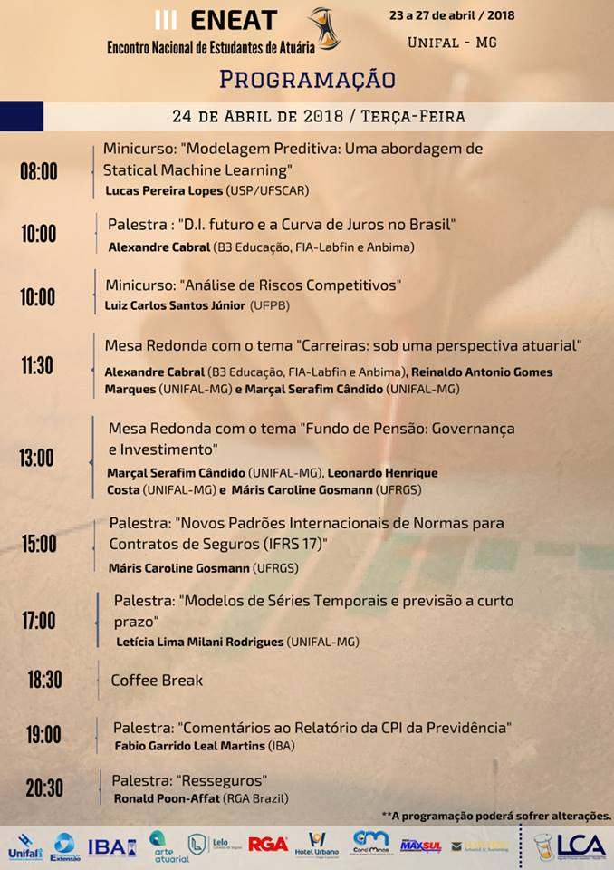
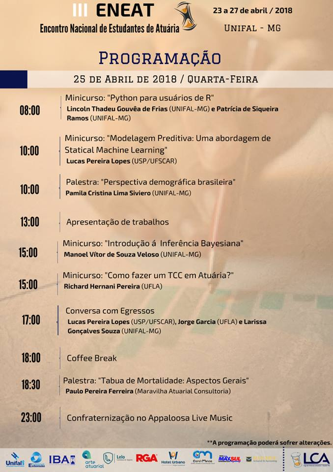
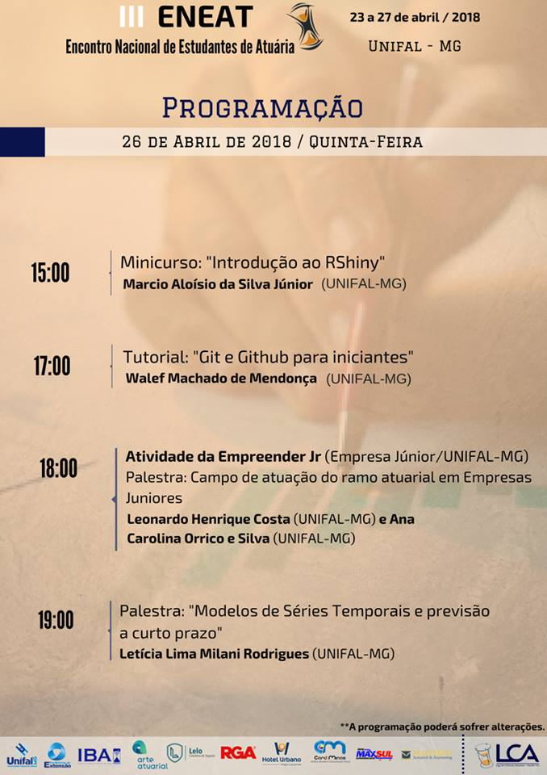
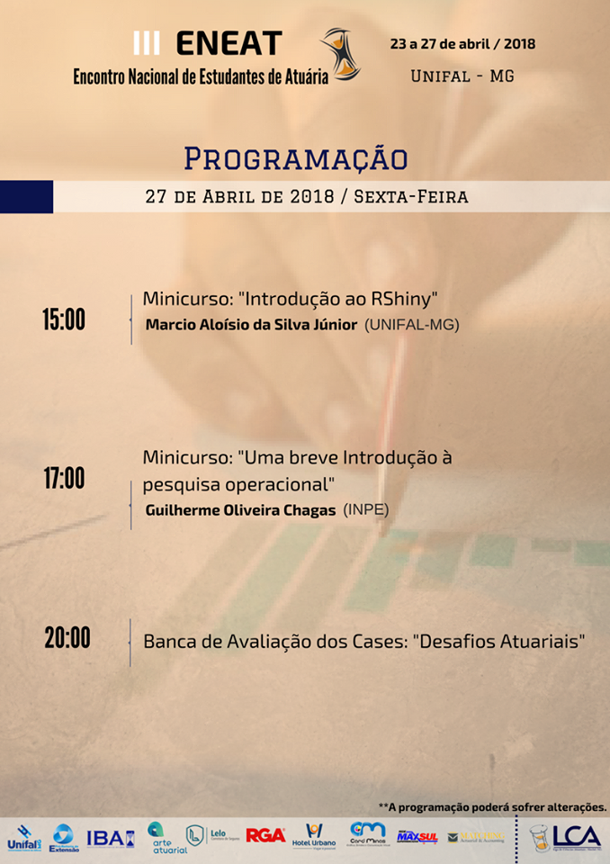

```{r setup, include=FALSE}
source("setup_knitr.R")
```

<br>
<br>

<center>



</center>

<br>
<br>

Após 13 anos, a Liga de Ciências Atuariais trouxe de volta o Encontro Nacional de Estudantes de Atuaria.

O III ENEAT foi realizado no *Campus* Avançado de Varginha da Universidade Federal de Alfenas entre os dias 23 e 27 de abril de 2018.

A LCA agradece a cada participante do encontro. **Muito obrigada!**

Um agradecimento especial aos estudantes, professores e toda comunidade universitária da Unifal-MG que nos acolheu tão bem!

Queremos agrader também aos nossos palestrantes e patrocinadores, por tornarem possível o retorno do ENEAT.

<br>
<br>

# PROGRAMAÇÃO

<br>



<br>



<br>



<br>



<br>



<br>
<br>

# Anais

<br>

A LCA agradece aos participantes por nos brindarem com trabalhos tão legais!

Os anais do III Encontro Nacional de Estudantes de Atuária podem ser acessados pelo link abaixo:

- <a href="https://sistemas.unifal-mg.edu.br/app/caex/comum/paginas/consultaAnais.php?preae=3609"target="_blank">**Anais - III ENEAT**</a>

<br>
<br>

## Fale conosco

<br>

Entre em contato conosco!

- lca.eneat@gmail.com
- lca.faleconosco@gmail.com