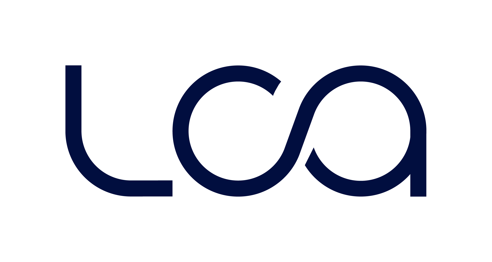

```{r setup, include=FALSE}
source("setup_knitr.R")
```

<p></p>
<p></p>

```{r, echo=FALSE, fig.align='center', dpi = 20}

```

<br></br>

## A Liga de Ciências Atuariais

<p></p>
<p></p>

\ \ \ \ \ \ A Liga de Ciências Atuariais (LCA) é uma associação sem fins lucrativos de atuação nacional. É composta por alunos de várias instituições e sua sede se localiza no Campus Avançado de Varginha da Universidade Federal de Alfenas.

\ \ \ \ \ \ A LCA foi fundada em 2016 por acadêmicos da UNIFAL-MG e tem como objetivo unir os cursos de graduação do país, de forma a trazer mais reconhecimento e desenvolvimento para nossa futura profissão.

\ \ \ \ \ \ Nossos valores são o compartilhamento de conhecimento, o respeito ao próximo e a busca constante de desenvolvimento pessoal e profissional. Todos os membros da LCA são voluntários com um ideal comum: o valor futuro atuarial. Entendemos que o conhecimento é um direito humano e portanto deve ser compartilhado, por isso quase todas as atividades promovidas pela LCA são gratuitas e abertas ao público.

\ \ \ \ \ \ Em dois anos de existência, a LCA já visitou diversas escolas, realizou eventos de abrangência nacional, como o ENEAT e o cursinho preparatório para o Exame de Admissão ao IBA, cuja última edição foi transmitida para todo o Brasil, apoiamos a realização de eventos em todo o país, como a Semana de Estatística e Atuária na UFRJ, o Simpósio de Atuária (maior evento de atuária do Nordeste) e disponibilizamos um portal de educação atuarial.

\ \ \ \ \ \ Este ano estaremos mais ativos que nunca! Temos um grande desafio pela frente: organizar o IV Encontro Nacional de Estudantes de Atuária na PUC-Rio, na cidade do Rio de Janeiro. Mas não abandonaremos nossas atividades internas na UNIFAL-MG, teremos atividades todos os meses!

\ \ \ \ \ \ Seja muito bem-vindo à Liga de Ciências Atuariais!

<br></br>

<!-- Adicionar contador de visitas -->