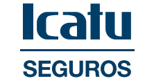

```{r setup, include=FALSE}
source("setup_knitr.R")
```

<br>
<br>

<center>


</center>

<br>
<br>


# INSCRIÇÕES 

<br>

O Encontro Nacional de Estudantes de Atuária surgiu em 2002, organizado por alunos da Universidade Federal de Minas Gerais.

Sua segunda edição aconteceu em 2005, também na UFMG.

Após 13 anos, a Liga de Ciências Atuariais organizou novamente o Encontro Nacional de Estudantes de Atuária, agora em sua terceira edição. Foram 5 dias de atividades intensas na Universidade Federal de Alfenas - Campus Avançado de Varginha.

Este ano, a LCA está trabalhando para que a quarta edição do ENEAT seja um sucesso.

Serão 3 dias de muita troca de conhecimento e inovação na cidade do Rio de janeiro.

Nos vemos nos dias 26, 27 e 28 de setembro!

<br>

<center>
<a href="https://www.e-inscricao.com/lca/eneat"target="_blank">**INSCREVA-SE**</a>
</center>

<br>
<br>


# SUBMISSÃO DE TRABALHOS

<br>

Está aberto o período de submissão de trabalhos acadêmicos para o IV Encontro Nacional de Estudantes de Atuária, não fique de fora!

O resumo expandido no formato PDF com tamanho mínimo de 2 páginas e máximo de 5 páginas deverá ser enviado pelo email lca.eneat@gmail.com com assunto **Submissão IV ENEAT** até o dia 20 de agosto de 2019.

- <a href="https://atuaria.github.io/PDF/Resumo_expandido.pdf"target="_blank">**Modelo obrigatório**</a>

- <a href="https://atuaria.github.io/ENEAT/Modelos de Resumos.zip"target="_blank">**Download do modelo no formato LaTeX**</a>

A avaliação será feita por, no mínimo, dois avaiadores que atribuirão os conceitos **aprovado**, **aprovado com correção** ou **reprovado**. Haverá um curto período para correção do resumo.

**O período de submissões termina no dia ~~1 de agosto de 2019~~ . Prazo prorrogado até o dia 20 de agosto de 2019.**

Os organizadores encorajam a submissão de artigos de pesquisa originais, relatórios de progresso de pesquisa e propostas de pesquisas futuras.

Os temas de interesse incluem, mas não se limitam a:

- História e futuro da Atuária
- Previdência
- Saúde Suplementar
- Seguros e Resseguros
- Demografia
- Modelagem preditiva
- Análise de Riscos e Ruína
- Análise Estatística de Big Data aplicada a Gestão Atuarial
- Métodos Estatísticos aplicados a Seguros, Saúde e Previdência
- Inovação e tecnologia

O tema abordado em seu trabalho deverá ser indicado no corpo do e-mail, bem como o nome completo do submetedor e meio alternativo de contato.

Não serão aceitos trabalhos com mais de cinco autores.

Cada participante poderá enviar, no máximo, dois trabalhos como autor principal (apresentador).

O autor apresentador deverá estar inscrito no IV ENEAT.

Trabalhos aceitos e não apresentados não serão publicados nos anais do IV ENEAT.

<br>

**DATAS IMPORTANTES**

- Fim do período de submissões: 20 de agosto de 2019
- Resultado das avaliações dos trabalhos: 30 de agosto de 2019

<br>
<br>


# LOCAL E DATA

<br>

O IV Encontro Nacional de Estudantes de Atuária será realizado nos dias 26, 27 e 28 de setembro de 2019 no Auditório Professor Carlos Alberto Del Castillo no edifício Rio Datacentro da Pontifícia Universidade Católica do Rio de Janeiro, na Rua Marquês de São Vicente, 225, Gávea - Rio de janeiro, RJ.

<br>
<br>

# PROGRAMAÇÃO

<br>

**PALESTRANTES CONFIRMADOS:**

- [Beatriz de Souza Bernardino](http://lattes.cnpq.br/5461147196661201) - [LinkedIn](https://www.linkedin.com/in/beatriz-de-souza-bernardino-b0101169/)
- Henrique Mazieiro - [LinkedIn](https://www.linkedin.com/in/henriquemazieiro/)
- Italoema Sanglard - [LinkedIn](https://www.linkedin.com/in/italoema-sanglard-762367157/)
- Letícia Doherty - [LinkedIn](https://www.linkedin.com/in/leticia-doherty/)
- [Profª. Drª. Luísa Pimenta Terra](http://lattes.cnpq.br/8370361542589630) - [LinkedIn](https://www.linkedin.com/in/luisa-terra-b8146256/)
- [Profª. Me. Máris Caroline Gosmman](http://lattes.cnpq.br/6150255901035347) - [LinkedIn](https://www.linkedin.com/in/m%C3%A1ris-caroline-gosmann-miba-msc-mba-16308b161/)
- [Profª. Drª. Narcisa Maria Gonçalves dos Santos](http://lattes.cnpq.br/8007781497694239) - [LinkedIn](https://www.linkedin.com/in/narcisa-santos-4a419824/)
- [Prof. Dr. Nikolai Valtchev Kolev](http://lattes.cnpq.br/2718343924989492) - [LinkedIn](https://www.linkedin.com/in/nikolai-kolev-89404255/)
- [Prof. Me. Paulo Pereira Ferreira](http://lattes.cnpq.br/8656813220459898) - [LinkedIn](https://www.linkedin.com/in/paulo-ferreira-a418a54b/)
- [Prof. Dr. Rafael Barbosa Nasser](http://lattes.cnpq.br/9503735014198416) - [LinkedIn](https://www.linkedin.com/in/rnasser/)
- Raniere Ramos - [LinkedIn](https://www.linkedin.com/in/raniereramos/)
- [Prof. Dr. Roberto Westenberger](http://lattes.cnpq.br/5762769221500857) - [LinkedIn](https://www.linkedin.com/in/westenr/)

<br>
<br>

# PATROCINADORES

<br>
<br>
<br>

<center>

<a href="http://www.puc-rio.br"target="_blank"></a>

<br>

<a href="http://www.puc-rio.br/ecoa"target="_blank">ECOA PUC-Rio</a>

<a href="http://insurtech.les.inf.puc-rio.br"target="_blank">Insurtech Innovation Program</a>

</center>

<br>
<br>
<br>
<br>

**COTA DIAMANTE**

<br>

<center>

<a href="https://portal.icatuseguros.com.br/"target="_blank"></a>\ \ \ \ \ \ \ <a href="https://www.mirador-atuarial.com.br/"target="_blank"></a>

</center>

<br>
<br>
<br>

**COTA OURO**

<br>

$-$

<br>
<br>
<br>

**COTA PRATA**

<br>
<br>
<br>

$-$

<br>
<br>
<br>

**COTA BRONZE**

<br>

<center>

<a href="https://www.prosperabr.com/index.php"target="_blank"></a>

</center>

<br>
<br>
<br>

**APOIO**

<br>

<center>

<a href="http://www.atuarios.org.br/"target="_blank"></a> \ \ \ \ \ \ \ <a href="http://www.arteatuarial.com.br"target="_blank"></a>

</center>


<br>


<br>
<br>

## Seja um patrocinador

<br>

- Se interessou pelo evento? Deseja ser um patrocinador? Entre em contato com nosso setor financeiro pelo e-mail financas.lca@gmail.com para mais informações!

- <a href="https://atuaria.github.io/PDF/Cotas de patrocínio.pdf"target="_blank">**Cotas de patrocínio**</a>

- <a href="https://atuaria.github.io/PDF/Sponsorship quotas.pdf"target="_blank">**Sponsorship quotas**</a>

<br>
<br>

## Fale conosco

<br>

Dúvidas e sugestões? Entre em contato conosco!

- lca.eneat@gmail.com
- lca.faleconosco@gmail.com