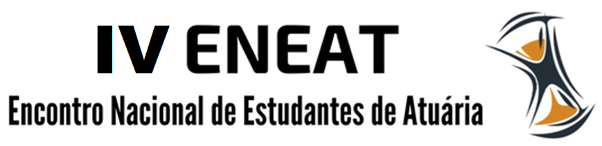
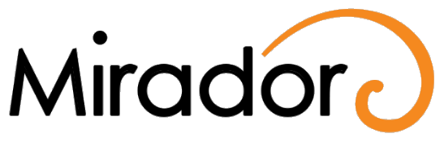
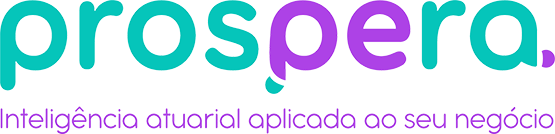

```{r setup, include=FALSE}
source("setup_knitr.R")
```

<br>
<br>

<center>



</center>

<br>
<br>

###INSCRIÇÕES

<br>

O Encontro Nacional de Estudantes de Atuária surgiu em 2002, organizado por alunos da Universidade Federal de Minas Gerais.

Sua segunda edição aconteceu em 2005, também na UFMG.

Após 13 anos, a Liga de Ciências Atuariais organizou novamente o Encontro Nacional de Estudantes de Atuária, agora em sua terceira edição. Foram 5 dias de atividades intensas na Universidade Federal de Alfenas - Campus Avançado de Varginha.

Este ano, a LCA está trabalhando para que a quarta edição do ENEAT seja um sucesso.

Serão 3 dias de muita troca de conhecimento e inovação na cidade do Rio de janeiro.

Nos vemos nos dias 26, 27 e 28 de setembro!

<br>

<center>
<a href="https://www.e-inscricao.com/lca/eneat"target="_blank">**INSCREVA-SE**</a>
</center>

<br>
<br>

###LOCAL E DATA

<br>

O IV Encontro Nacional de Estudantes de Atuária será realizado nos dias 26, 27 e 28 de setembro de 2019 no Auditório Professor Carlos Alberto Del Castillo no edifício Rio Datacentro da Pontifícia Universidade Católica do Rio de Janeiro, na Rua Marquês de São Vicente, 225, Gávea - Rio de janeiro, RJ.

<br>
<br>

###PROGRAMAÇÃO

<br>

Veja a [programação](https://www.e-inscricao.com/lca/eneat#schedule-section) do IV ENEAT.

<br>
<br>

###PALESTRANTES

<br>

Conheça os [palestrantes](https://www.e-inscricao.com/lca/eneat#speakers-or-bands-section) do IV ENEAT.

<br>
<br>

### PATROCINADORES

<br>
<br>
<br>

<center>

<a href="http://www.puc-rio.br"target="_blank"></a>

<br>

<a href="http://www.puc-rio.br/ecoa"target="_blank">ECOA PUC-Rio</a>

<a href="http://insurtech.les.inf.puc-rio.br"target="_blank">Insurtech Innovation Program</a>

</center>

<br>
<br>
<br>
<br>

**COTA DIAMANTE**

<br>

<center>

<a href="https://www.soa.org/"target="_blank"></a>\ \ \ \ \ \ \ <a href="https://portal.icatuseguros.com.br/"target="_blank"></a>\ <br><br> \ <a href="https://www.mirador-atuarial.com.br/"target="_blank"></a>

</center>

<br>
<br>
<br>

**COTA OURO**

<br>

<center>

<a href="http://plurall.com.br/plurall/"target="_blank"></a>

</center>

<br>
<br>
<br>

**COTA PRATA**

<br>
<br>
<br>

<center>


</center>

<br>
<br>
<br>

**COTA BRONZE**

<br>

<center>

<a href="https://www.prosperabr.com/index.php"target="_blank"></a>

</center>

<br>
<br>
<br>

**APOIO**

<br>

<center>

<a href="http://www.atuarios.org.br/"target="_blank"></a> \ \ \ \ \ \ \ <a href="http://www.arteatuarial.com.br"target="_blank"></a>

</center>


<br>


<br>
<br>

### SEJA UM PATROCINADOR

<br>

- Se interessou pelo evento? Deseja ser um patrocinador? Entre em contato com nosso setor financeiro pelo e-mail financas.lca@gmail.com para mais informações!

- <a href="https://atuaria.github.io/PDF/Cotas de patrocínio.pdf"target="_blank">**Cotas de patrocínio**</a>

- <a href="https://atuaria.github.io/PDF/Sponsorship quotas.pdf"target="_blank">**Sponsorship quotas**</a>

<br>
<br>

### FALE CONOSCO

<br>

Dúvidas e sugestões? Entre em contato conosco!

- lca.eneat@gmail.com
- lca.faleconosco@gmail.com