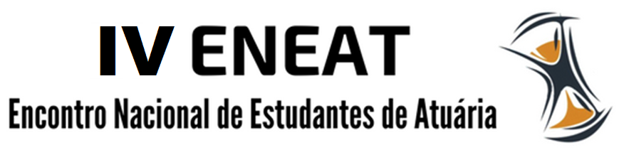
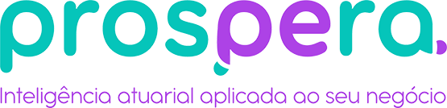

```{r setup, include=FALSE}
source("setup_knitr.R")
```

<br>
<br>

<center>



</center>

<br>
<br>


# INSCRIÇÕES 

<br>

O Encontro Nacional de Estudantes de Atuária surgiu em 2002, organizado por alunos da Universidade Federal de Minas Gerais.

Sua segunda edição aconteceu em 2005, também na UFMG.

Após 13 anos, a Liga de Ciências Atuariais organizou novamente o Encontro Nacional de Estudantes de Atuária, agora em sua terceira edição. Foram 5 dias de atividades intensas na Universidade Federal de Alfenas - Campus Avançado de Varginha.

Este ano, a LCA está trabalhando para que a quarta edição do ENEAT seja um sucesso.

Serão 3 dias de muito compartilhamento na cidade de Rio de janeiro.

<br>

<center>
<a href="https://www.e-inscricao.com/lca/eneat"target="_blank">**INSCREVA-SE**</a>
</center>

<br>
<br>


# SUBMISSÃO DE TRABALHOS

<br>

Está aberto o período de submissão de trabalhos acadêmicos para o IV Encontro Nacional de Estudantes de Atuária, não fique de fora!

O resumo expandido no formato PDF com tamanho mínimo de 2 páginas e máximo de 5 páginas deverá ser enviado pelo email lca.eneat@gmail.com com assunto **Submissão IV ENEAT** até o dia 1 de agosto de 2019.

- <a href="https://atuaria.github.io/PDF/Resumo_expandido.pdf"target="_blank">**Modelo obrigatório**</a>

- <a href="https://atuaria.github.io/ENEAT/Modelos de Resumos.zip"target="_blank">**Download do modelo no formato LaTeX**</a>

A avaliação será feita por, no mínimo, dois avaiadores que atribuirão os conceitos **aprovado**, **aprovado com correção** ou **reprovado**. Haverá um curto período para correção do resumo.

**O período de submissões termina no dia 1 de agosto de 2019. Não haverá prorrogação deste prazo.**

Os organizadores encorajam a submissão de artigos de pesquisa originais, relatórios de progresso de pesquisa e propostas de pesquisas futuras.

Os temas de interesse incluem, mas não se limitam a:

- História e futuro da Atuária
- Previdência
- Saúde Suplementar
- Seguros e Resseguros
- Demografia
- Modelagem preditiva
- Análise de Riscos e Ruína
- Análise Estatística de Big Data aplicada a Gestão Atuarial
- Métodos Estatísticos aplicados a Seguros, Saúde e Previdência
- Inovação e tecnologia

O tema abordado em seu trabalho deverá ser indicado no corpo do e-mail, bem como o nome completo do submetedor e meio alternativo de contato.

Não serão aceitos trabalhos com mais de cinco autores.

Cada participante poderá enviar, no máximo, dois trabalhos como autor principal (apresentador).

O autor apresentador deverá estar inscrito no IV ENEAT.

Trabalhos aceitos e não apresentados não serão publicados nos anais do IV ENEAT.

<br>

**DATAS IMPORTANTES**

- Fim do período de submissões: 1 de agosto de 2019
- Resultado das avaliações dos trabalhos: 20 de agosto de 2019

<br>
<br>


# LOCAL

<br>

O IV Encontro Nacional de Estudantes de Atuária será realizado no Auditório Professor Carlos Alberto Del Castillo no edifício Rio Datacentro da Pontifícia Universidade Católica do Rio de Janeiro, na Rua Marquês de São Vicente, 225, Gávea - Rio de janeiro, RJ.

<br>
<br>

# PROGRAMAÇÃO

<br>

**PALESTRANTES CONFIRMADOS:**

- Beatriz Bernardino
- Henrique Mazieiro
- Italoema Sanglard
- Letícia Doherty
- Luísa Terra
- Máris Caroline Gosmman
- Narcisa Santos
- Nikolai Valtchev Kolev
- Paulo Pereira Ferreira
- Rafael Nasser
- Raniere Ramos
- Roberto Westenberger

<br>
<br>

# PATROCINADORES

<br>

<center>

<a href="http://www.puc-rio.br"target="_blank"></a>

<a href="http://www.puc-rio.br/ecoa"target="_blank">ECOA PUC-Rio</a>

<a href="http://insurtech.les.inf.puc-rio.br"target="_blank">Insurtech Innovation Program</a>

</center>

<br>

**COTA DIAMANTE**

<br>

**COTA OURO**

<br>

**COTA PRATA**

<br>

**COTA BRONZE**

<br>

<center>

<a href="https://www.prosperabr.com/index.php"target="_blank"></a>

</center>


<br>

**APOIO**

<br>

<center>

<a href="http://www.atuarios.org.br/"target="_blank"></a>

</center>


<br>


<br>
<br>

## Fale conosco

- lca.eneat@gmail.com
- lca.faleconosco@gmail.com